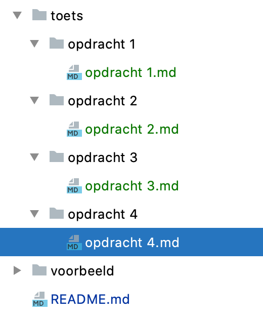

# TST-toets (2020 periode 1)
Deze toets gaat over het unit testen van JavaScript en het gebruik van Jasmine hiervoor.

## Opdrachten en beschrijving van de opdracht
De toets bestaat uit 4 javascript opdrachten die in de directory toets staan.
Elke vraag heeft een eigen directory. Zie onderstaande afbeelding.

De beschrijving van de opdracht zelf vind je in het bijbehorende .md bestand van de opdracht directory.

## Voorbeeld
In de directory voorbeeld vind je een HTML bestand, een JavaScript bestand met eigen code aan en de bijbehorende Jasmine libraries.
Dit voorbeeld kun je gebruiken mocht je even niet meer weten hoe het je Jasmine in een browser kunt gebruiken en wat voor uitvoer daarbij hoort.

Voor sommige opdrachten heb je de Jamine libraries weer nodig, die kun je dus weer hergebruiken.

## Beoordeling, inleveren en spelregels
Voor elke vraag kun je maximaal twee punten krijgen. 
Voor het meedoen, gebruik van Github voor inleveren krijg je ook twee punten zodat je maximaal een 10 kunt halen.

Onderdeel  | Punten
--- | ---
Opdracht 1 | 2 
Opdracht 2 | 2 
Opdracht 3 | 2 
Opdracht 4 | 2 
Github gebruik | 1 
Toets maken | 1
Totaal | 10

### Github Classroom
Het inleveren wordt gedaan op je private repository van Github Classroom. 

### Wat mag wel en wat mag niet
Je mag bij deze opdrachten alle presentaties van de afgelopen lessen gebruiken. Je mag ook gebruik maken van internet om extra uitleg op te zoeken.  

Wat niet mag is code delen, code kopiëren van internet, code kopiëren van medestudenten of hulp en uitleg geven aan een ander of hulp en uitleg krijgen van een ander.   
Als dit wel gedaan wordt krijgt zowel de student die de code deelt of hulp geeft als degene die de code kopieert een onvoldoende. 

### Tip
Ik raad je aan om tussentijds, bijvoorbeeld bij elke opdracht, je code en antwoorden op Github te zetten.  

